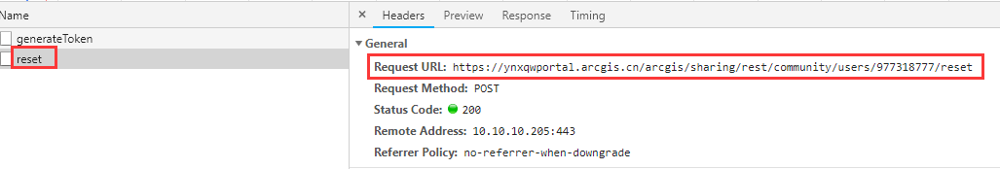
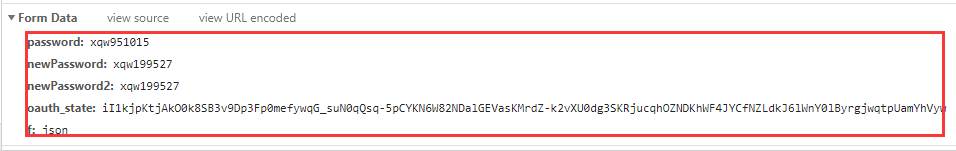
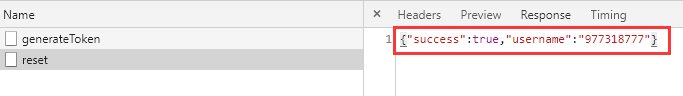
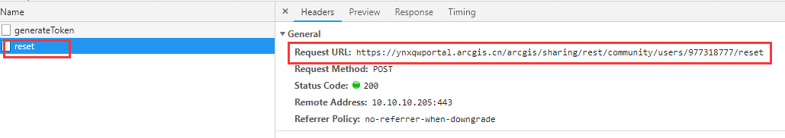
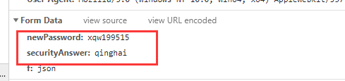
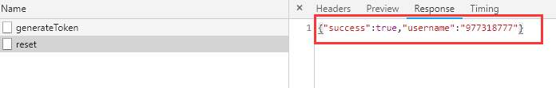

## 描述
在使用我们的Portal REST API过程中，官方Portal REST API文档是有缺失的，即有些API并没有在官方文档里说明，我们只能通过抓取某一操作过程的后台请求来确定具体使用了哪个API，所以这给我们的开发工作带来了很大的不便，此系列文章逐渐将这些官方没有说明的API进行补充说明。   
今天就介绍Portal中用来进行用户密码重置的接口——reset接口。

## 接口参考地址
`https://主机域名/arcgis/sharing/rest/community/users/用户名/reset`

## 接口使用方法
此接口根据传递参数的不同，可以有两种使用方法，下面具体介绍这两种调用方法：   
### 1. 知道原密码、新密码的情况   
在知道原密码、新密码的情况下，我们向此接口传递的参数分别是：**旧密码、新密码、确认后的新密码、token**这四个参数。如果密码重置成功，会返回用户名和修改的状态（一般是true），下面来看具体的接口调用：   
```
	//token生成成功，重置密码
	$.ajax({
		url:"https://ynxqwportal.arcgis.cn/arcgis/sharing/rest/"+
	 +"community/users/"+$("#username").val()+"/reset",
		type:"POST",
		data:{
			password: $("#oldpassword").val(),       //旧密码
			newPassword: $("#newpassword").val(),    //新密码
			newPassword2: $("#newpassword").val(),   //新密码
			oauth_state: portalToken,                //生成的token
			f:"json"
		},
		dataType:"json",
		async:false,
		success:function(data02){
			console.log(data02);
			if(data02.success){
				alert("密码修改成功");
			}else{
				alert("密码修改失败");
			}
		},
		error:function(e02){
			console.log(e01);
		}
	});
```   

执行成功后我们可以在浏览器的控制面板看到具体的请求、返回信息，如下：   
   
< center>图1.1 请求的具体地址< /center>   
   
<center>图1.2 请求的参数</center>   
   
<center>图1.3 密码重置成功后的返回信息</center>   
由上面的代码和截图详细介绍了在能够获取到用户旧密码和新密码的前提下重置用户密码的操作过程，接下来我们介绍另一种重置用户密码的方式。   
   
### 2. 无法获取用户旧密码，仅仅知道新密码的情况   
在无法获取用户旧密码的情况下，如果我们需要调用此接口来重置此用户密码，那我们的思路就是按照忘记密码来执行。此时向此接口传递的参数分别是：新密码和安全问题答案。下面来结合代码具体介绍：   
``` 

	//token生成成功，重置密码，按照忘记密码的思路
	$.ajax({
		url:"https://ynxqwportal.arcgis.cn/arcgis/sharing/rest/"+
	 +"community/users/"+$("#username").val()+"/reset",
		type:"POST",
		data:{
			newPassword: $("#newpassword").val(),     //用户新密码
			securityAnswer:"qinghai",                 //安全问题的答案
			f:"json"
		},
		dataType:"json",
		async:false,
		success:function(data02){
			console.log(data02);
	            if(data02.success){
				alert("密码修改成功");
			}else{
				alert("密码修改失败");
			}
		},
		error:function(e02){
			console.log(e01);
		}
	});
```   
由上述代码可见，此接口调用的方法除了参数之外，其他的和第一种方式完全一致，两种方式的差别就是传递的参数不同。第二种方式仅仅需要新密码和用户安全问题即可。下面来看具体的请求信息、返回信息：   
   
<center>图2.1 请求地址</center>   
   
<center>请求参数</center>   
   
上述代码和截图详细介绍了第二种密码重置方式，其实两种方式的调用地址都相同，唯一的区别就是传递参数不同。在实际环境中大家可以根据具体情况选择适合的密码重置方式。